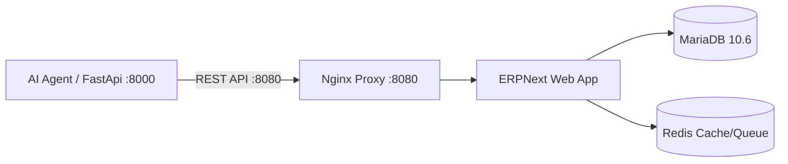

# 📘 HƯỚNG DẪN THIẾT LẬP PHÂN HỆ NEXTERP (ERPNEXT) CHO DEVELOPER

Tài liệu này hướng dẫn chi tiết từng bước cho các lập trình viên (Developers) khi clone dự án về máy, muốn cài đặt, khởi chạy và cấu hình toàn bộ phân hệ Quản trị Doanh nghiệp **NextERP (ERPNext v15)** kết nối trực tiếp với AI Agent.

---

## 🏗️ 1. Tổng quan Kiến trúc

Phân hệ ERP được đóng gói hoàn chỉnh trong Docker Compose ([`docker-compose.erpnext.yml`](file:///Users/huynhlehoaibao/Documents/AIAgent_mar/docker-compose.erpnext.yml)):

* 🌐 **Cổng Web App & REST API:** `http://localhost:8080` (hoặc qua Nginx proxy).
* 🗄️ **Cơ sở dữ liệu:** MariaDB 10.6 (`erpnext-db`).
* ⚡ **Bộ nhớ đệm & Hàng đợi:** Redis Cache & Redis Queue (`erpnext-redis-cache`, `erpnext-redis-queue`).
* 📦 **Core Engine:** Frappe Framework / ERPNext v15 (`erpnext-web`).



---

## ⚙️ 2. Yêu cầu Hệ thống

* **Docker & Docker Compose** (Docker Desktop đã được cài đặt và đang chạy).
* **Python 3.11+** và môi trường ảo `.venv` của dự án.
* Dung lượng RAM trống tối thiểu: **2GB - 4GB**.

---

## 🚀 3. Các bước Cài đặt & Thiết lập

### Bước 1: Khởi động cụm Container Docker NextERP

Tại thư mục gốc của dự án, chạy lệnh:

```bash
# Khởi động toàn bộ 4 container của NextERP chạy ngầm
docker compose -f docker-compose.erpnext.yml up -d
```

Kiểm tra trạng thái các container:
```bash
docker compose -f docker-compose.erpnext.yml ps
```
> Khi thấy cả 4 service (`erpnext-proxy`, `erpnext-web`, `erpnext-db`, `erpnext-redis-cache`) ở trạng thái **`Up`**, NextERP đã sẵn sàng.

---

### Bước 2: Đăng nhập vào Giao diện NextERP

1. Mở trình duyệt và truy cập: **[http://localhost:8080](http://localhost:8080)** (hoặc `http://localhost:8080/app`).
2. Thông tin đăng nhập mặc định:
   * **Username:** `Administrator`
   * **Password:** `admin` (hoặc mật khẩu bạn đã cấu hình lúc setup site).
   *(Nếu hệ thống yêu cầu đổi mật khẩu lần đầu, hãy nhập mật khẩu mới và ghi nhớ lại).*

---

### Bước 3: Tạo API Key & API Secret để AI Agent kết nối

Để AI Agent có thể tự động đọc tồn kho và tạo Đơn bán hàng (Sales Order), bạn cần cấp mã API Token cho tài khoản `Administrator`:

1. Trên thanh tìm kiếm ở đầu trang NextERP, gõ: **`User List`** (hoặc truy cập `http://localhost:8080/app/user`).
2. Bấm chọn tài khoản **`Administrator`**.
3. Cuộn chuột xuống phần **API Access** (Truy cập API).
4. Bấm vào nút **`Generate Keys`** (Tạo khóa).
5. NextERP sẽ hiển thị một popup chứa:
   * **API Key:** `e.g. 5a1b2c3d4e5f...`
   * **API Secret:** `e.g. 9z8y7x6w5v4u...` *(Lưu ý: API Secret chỉ hiển thị duy nhất 1 lần, hãy copy lại ngay)*.

---

### Bước 4: Cấu hình biến môi trường `.env`

Mở file [`.env`](file:///Users/huynhlehoaibao/Documents/AIAgent_mar/.env) ở thư mục gốc dự án và điền thông tin vừa tạo:

```env
# ==========================================
# CẤU HÌNH NEXTERP / ERPNEXT
# ==========================================
ERP_PROVIDER=nexterp
NEXTERP_BASE_URL=http://localhost:8080
NEXTERP_API_KEY=dán_api_key_vào_đây
NEXTERP_API_SECRET=dán_api_secret_vào_đây
```

---

### Bước 5: Tự động nạp 13 Sản phẩm BLANICA lên NextERP

Dự án đã chuẩn bị sẵn kịch bản tự động đồng bộ từ file dữ liệu [`data/catalog.json`](file:///Users/huynhlehoaibao/Documents/AIAgent_mar/data/catalog.json). Bạn chỉ cần chạy lệnh sau:

```bash
# Kích hoạt môi trường ảo (nếu chưa kích hoạt)
source .venv/bin/activate

# Chạy script nạp sản phẩm
python scripts/nap_san_pham_erp.py
```

**Kết quả thành công sẽ hiển thị:**
```text
📦 Tìm thấy 13 sản phẩm trong catalog.
✅ Đã kết nối NextERP thành công với tài khoản: Administrator
  ✨ Tạo mới: BLA-BODY-WAX-120G - Kem Tẩy Lông BLANICA Hair Removal Cream 120g (290,000đ)
  ✨ Tạo mới: BLA-FACE-SERUM-30ML - Serum Dưỡng Trắng & Làm Dịu BLANICA Whitening & Soothing Serum 30ml (440,000đ)
  ...
🎉 Hoàn tất! Đã đồng bộ 13/13 sản phẩm lên NextERP.
```

---

## 🧪 4. Kiểm tra Kết nối & Kiểm thử Tự động

### 1. Chạy bài test tích hợp ERP:
```bash
PYTHONPATH=. pytest tests/test_erp_integration.py -v
```
Toàn bộ **3 test cases** (kết nối API, lấy tồn kho, tạo Sales Order, đính kèm mã vận đơn GHN) sẽ chạy và báo **PASSED**.

### 2. Kiểm tra trên Giao diện Web:
* Truy cập: **[http://localhost:8080/app/item](http://localhost:8080/app/item)** để xem 13 sản phẩm Blanica đã có mặt trên hệ thống.
* Truy cập: **[http://localhost:8080/app/sales-order](http://localhost:8080/app/sales-order)** để xem các đơn hàng do AI Agent tự động chốt từ Zalo đổ về.

---

## 🛠️ 5. Các lệnh Quản lý Docker thường dùng

| Thao tác | Câu lệnh Terminal |
| :--- | :--- |
| **Khởi động NextERP** | `docker compose -f docker-compose.erpnext.yml up -d` |
| **Tạm dừng NextERP** | `docker compose -f docker-compose.erpnext.yml stop` |
| **Bật lại sau khi stop** | `docker compose -f docker-compose.erpnext.yml start` |
| **Xem log container Web** | `docker logs -f erpnext-web` |
| **Xóa sạch và tạo lại từ đầu** | `docker compose -f docker-compose.erpnext.yml down -v` |

---

## ❓ 6. Xử lý sự cố thường gặp (Troubleshooting)

### 1. Bị trùng cổng `8080`:
Nếu máy bạn đã có ứng dụng khác chạy cổng `8080`, hãy mở file [`docker-compose.erpnext.yml`](file:///Users/huynhlehoaibao/Documents/AIAgent_mar/docker-compose.erpnext.yml) sửa:
```yaml
ports:
  - "8085:80"  # Đổi thành 8085
```
Sau đó cập nhật trong `.env`: `NEXTERP_BASE_URL=http://localhost:8085`.

### 2. Quên mật khẩu `Administrator` trong Docker:
Bạn có thể đặt lại mật khẩu Admin trực tiếp qua lệnh container:
```bash
docker exec -it erpnext-web bench --site frontend set-admin-password mat_khau_moi_123
```

---

🎉 **Chúc bạn thiết lập thành công! Mọi thắc mắc vui lòng kiểm tra thêm tài liệu kiến trúc tại [`docs/kien-truc.md`](file:///Users/huynhlehoaibao/Documents/AIAgent_mar/docs/kien-truc.md).**
