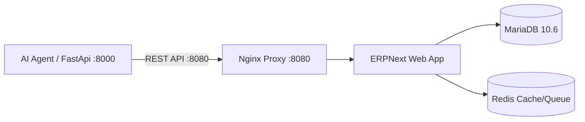

# 📘 HƯỚNG DẪN THIẾT LẬP PHÂN HỆ NEXTERP (ERPNEXT) CHO DEVELOPER

Tài liệu này hướng dẫn chi tiết từng bước cho các lập trình viên (Developers) khi clone dự án về máy, muốn cài đặt, khởi chạy và cấu hình toàn bộ phân hệ Quản trị Doanh nghiệp **NextERP (ERPNext v15)** kết nối trực tiếp với AI Agent.

---

## 🏗️ 1. Tổng quan Kiến trúc

Phân hệ ERP được đóng gói hoàn chỉnh trong Docker Compose ([`docker-compose.erpnext.yml`](../docker-compose.erpnext.yml)):

* 🌐 **Cổng Web App & REST API:** `http://localhost:8080` (hoặc qua Nginx proxy).
* 🗄️ **Cơ sở dữ liệu:** MariaDB 10.6 (`erpnext-db`).
* ⚡ **Bộ nhớ đệm & Hàng đợi:** Redis Cache & Redis Queue (`erpnext-redis-cache`, `erpnext-redis-queue`).
* 📦 **Core Engine:** Frappe Framework / ERPNext v15 (`erpnext-web`).



---

## ⚙️ 2. Yêu cầu Hệ thống

* **Docker & Docker Compose** (Docker Desktop đã được cài đặt và đang chạy).
* **Python 3.11+** và môi trường ảo `.venv` của dự án.
* Dung lượng RAM trống tối thiểu: **2GB - 4GB**.

---

## 🚀 3. Các bước Cài đặt & Thiết lập

### Bước 1: Khởi động cụm Container Docker NextERP

Tại thư mục gốc của dự án, chạy lệnh:

```bash
# Khởi động toàn bộ 4 container của NextERP chạy ngầm
docker compose -f docker-compose.erpnext.yml up -d
```

Kiểm tra trạng thái các container:
```bash
docker compose -f docker-compose.erpnext.yml ps
```
> Cả 5 service (`erpnext-proxy`, `erpnext-web`, `erpnext-db`,
> `erpnext-redis-cache`, `erpnext-redis-queue`) phải ở trạng thái **`Up`**.

**Nhưng `Up` CHƯA phải sẵn sàng.** Mở `http://localhost:8080` lúc này sẽ ra
**404** — container chạy nhưng chưa có *site* nào bên trong. Đó là bước 1b.

---

### Bước 1b: Tạo site (chỉ làm MỘT LẦN, trên máy mới)

Compose chỉ dựng tiến trình; nó không tạo cơ sở dữ liệu của ERPNext. Thiếu
bước này thì mọi bước sau đều thất bại với 404, và log của `erpnext-web`
trông hoàn toàn bình thường — gunicorn vẫn báo "Listening at 0.0.0.0:8000".
Đó là lý do bước này dễ bị bỏ qua nhất.

Trỏ ERPNext tới CSDL và Redis trong cùng mạng docker:

```bash
docker exec erpnext-web bench set-config -g db_host erpnext-db
docker exec erpnext-web bench set-config -g redis_cache "redis://erpnext-redis-cache:6379"
docker exec erpnext-web bench set-config -g redis_queue "redis://erpnext-redis-queue:6379"
docker exec erpnext-web bench set-config -g redis_socketio "redis://erpnext-redis-queue:6379"
```

Rồi tạo site. Mất vài phút:

```bash
docker exec erpnext-web bench new-site localhost --mariadb-root-password erpnext_root_password --admin-password admin --install-app erpnext --no-mariadb-socket
```

> **Tên site phải là `localhost`.** `nginx.erpnext.conf` gửi header
> `X-Frappe-Site-Name localhost`; đặt tên khác thì nginx tìm không ra site
> và vẫn trả 404.

Trên Windows dùng Git Bash, thêm `MSYS_NO_PATHCONV=1` vào đầu mỗi lệnh
`docker exec` — nếu không, Git Bash bẻ `/home/frappe/...` thành đường dẫn
Windows và lệnh báo "No such file or directory" một cách khó hiểu.

---

### Bước 2: Đăng nhập vào Giao diện NextERP

1. Mở trình duyệt và truy cập: **[http://localhost:8080](http://localhost:8080)** (hoặc `http://localhost:8080/app`).
2. Thông tin đăng nhập mặc định:
   * **Username:** `Administrator`
   * **Password:** `admin` (hoặc mật khẩu bạn đã cấu hình lúc setup site).
   *(Nếu hệ thống yêu cầu đổi mật khẩu lần đầu, hãy nhập mật khẩu mới và ghi nhớ lại).*

---

### Bước 3–4 làm tự động (khuyên dùng)

Hai bước dưới đây có thể chạy bằng một lệnh. Nó đăng nhập, sinh khoá API,
hỏi ERPNext xem có những kho và bảng giá nào, rồi ghi thẳng vào `.env`:

```bash
python -m scripts.noi_erpnext --xem     # chỉ xem, không sinh khoá
python -m scripts.noi_erpnext           # làm thật
```

**Khoá không bao giờ được in ra màn hình** — in ra là để lại bí mật trong
lịch sử terminal và trong ảnh chụp màn hình. Cùng quy ước với
`scripts/sinh_token.py`.

Nếu ERPNext có **nhiều hơn một** kho hoặc bảng giá, script liệt kê ra rồi
**dừng** thay vì tự chọn. Đoán bừa một kho không gây lỗi — nó sai **im
lặng**, và triệu chứng duy nhất là tồn kho lệch mãi về sau.

Muốn làm tay thì đọc tiếp hai bước dưới.

---

### Bước 3: Tạo API Key & API Secret để AI Agent kết nối

Để AI Agent có thể tự động đọc tồn kho và tạo Đơn bán hàng (Sales Order), bạn cần cấp mã API Token cho tài khoản `Administrator`:

1. Trên thanh tìm kiếm ở đầu trang NextERP, gõ: **`User List`** (hoặc truy cập `http://localhost:8080/app/user`).
2. Bấm chọn tài khoản **`Administrator`**.
3. Cuộn chuột xuống phần **API Access** (Truy cập API).
4. Bấm vào nút **`Generate Keys`** (Tạo khóa).
5. NextERP sẽ hiển thị một popup chứa:
   * **API Key:** `e.g. 5a1b2c3d4e5f...`
   * **API Secret:** `e.g. 9z8y7x6w5v4u...` *(Lưu ý: API Secret chỉ hiển thị duy nhất 1 lần, hãy copy lại ngay)*.

---

### Bước 4: Cấu hình biến môi trường `.env`

Mở file [`.env`](../.env) ở thư mục gốc dự án và điền thông tin vừa tạo:

```env
# ==========================================
# CẤU HÌNH NEXTERP / ERPNEXT
# ==========================================
ERP_LOAI=erpnext
ERPNEXT_URL=http://localhost:8080
ERPNEXT_API_KEY=dán_api_key_vào_đây
ERPNEXT_API_SECRET=dán_api_secret_vào_đây

# HAI TRƯỜNG DƯỚI ĐÂY LÀ BẮT BUỘC — adapter NỔ ngay lúc khởi động nếu thiếu.
#
# Thiếu mã kho thì lời gọi `Bin` trả về tồn của MỌI kho cộng lại: một con số
# trông hoàn toàn hợp lý và sai, không ai phát hiện cho tới lúc giao hàng từ
# kho không có hàng. Thiếu bảng giá thì mỗi sản phẩm có thể trả nhiều mức giá.
#
# Tên phải khớp CHÍNH XÁC với tên trong ERPNext (mục Kho và Bảng giá).
ERP_MA_KHO=Kho Chính - AS
ERP_PRICELIST=Bảng giá bán lẻ
```

---

### Bước 5: Quản lý & Nhập/Xuất Sản phẩm 100% trên Giao diện Web NextERP

Người quản lý hoặc Dev có thể quản lý sản phẩm hoàn toàn trực quan qua giao diện web:

1. **Xem danh sách sản phẩm:**
   * Truy cập: **[http://localhost:8080/app/item](http://localhost:8080/app/item)**.
2. **Xuất danh sách sản phẩm ra Excel / CSV:**
   * Tích chọn các sản phẩm (hoặc tích chọn tất cả ở ô trên cùng).
   * Nhìn lên góc trên bên phải, bấm nút **`Thao tác` (Actions)** hoặc **`...`** ➔ Chọn **`Xuất dữ liệu` (Export)** ➔ Chọn định dạng **Excel / CSV** ➔ Bấm **`Tải xuống` (Download)**.
3. **Nhập dữ liệu hàng loạt (Data Import):**
   * Truy cập: **[http://localhost:8080/app/data-import](http://localhost:8080/app/data-import)**.
   * Chọn Doctype là `Item` ➔ Tải file mẫu Excel về điền thông tin và tải lên để hệ thống tự động nạp hàng trăm sản phẩm.

---

## ⚠️ Điều phải biết trước khi nối: ERP chỉ cấp **nửa** dữ liệu

ERPNext cho mã, tên, nhóm hàng, dung tích, **giá** và **tồn kho**. Nó
**không** cấp — và sẽ không bao giờ cấp — chín trường làm nên chất tư vấn:
loại da phù hợp, vấn đề hỗ trợ, thành phần chính, cách dùng, pH, số công bố…

Chín trường ấy ở lại `data/catalog.json`. Đây là thiết kế có chủ ý, ghi rõ
trong `agent/erp/ho_so.py`: ERP kế toán không phải chỗ chứa văn bản tư vấn,
và để chúng ở ngoài thì **đổi ERP không mất gì**.

Hệ quả cụ thể khi bạn nối ERPNext:

| Tình huống | Agent làm gì |
|---|---|
| SKU **có** hồ sơ tư vấn trong `catalog.json` | Tư vấn bình thường |
| SKU **chưa có** hồ sơ tư vấn | **Bị loại khỏi `goi_y_san_pham`**, và cổng ghi `erp.thieu_ho_so` vào nhật ký |
| Khách hỏi đích danh SKU chưa có hồ sơ | Vẫn trả giá và tồn (số thật), kèm cảnh báo cấm agent suy đoán công dụng |

Nghĩa là nối ERPNext với 200 SKU mà chưa viết hồ sơ tư vấn nào thì agent sẽ
**không gợi ý được gì cả**. Nó không hỏng — nó đang từ chối khuyên khi không
có căn cứ, đúng nguyên tắc của hệ thống.

---

## 🧪 4. Kiểm tra Kết nối & Kiểm thử Tự động

### 1. Kiểm kết nối ERP:
```bash
python -m scripts.thu_erp
```

Lệnh này đọc `ERP_LOAI` rồi thử đúng đường mà agent sẽ đi: xác thực, lấy
danh mục, hỏi giá và tồn của một mã. Còn chữ `CHẶN` nào thì agent chưa dùng
được ERP.

### 2. Nạp danh mục lên ERPNext:
```bash
python -m scripts.nap_san_pham_erp --thu    # xem trước, KHÔNG ghi gì
python -m scripts.nap_san_pham_erp          # ghi thật
```

Chế độ `--thu` chạy được cả khi chưa cấu hình gì — nó không kết nối đi đâu,
chỉ in ra sẽ đẩy những gì.

Script **từ chối chạy** khi `data/catalog.json` còn cờ `du_lieu_mau: true`.
Đẩy danh mục mẫu lên ERP thật là đưa hàng không có thật vào hệ thống bán
hàng, rồi có người lên đơn từ đó.

### 2. Kiểm tra trên Giao diện Web:
* Truy cập: **[http://localhost:8080/app/item](http://localhost:8080/app/item)** để xem 13 sản phẩm Blanica đã có mặt trên hệ thống.
* Truy cập: **[http://localhost:8080/app/sales-order](http://localhost:8080/app/sales-order)** để xem các đơn hàng do AI Agent tự động chốt từ Zalo đổ về.

---

## 🛠️ 5. Các lệnh Quản lý Docker thường dùng

| Thao tác | Câu lệnh Terminal |
| :--- | :--- |
| **Khởi động NextERP** | `docker compose -f docker-compose.erpnext.yml up -d` |
| **Tạm dừng NextERP** | `docker compose -f docker-compose.erpnext.yml stop` |
| **Bật lại sau khi stop** | `docker compose -f docker-compose.erpnext.yml start` |
| **Xem log container Web** | `docker logs -f erpnext-web` |
| **Xóa sạch và tạo lại từ đầu** | `docker compose -f docker-compose.erpnext.yml down -v` |

---

## ❓ 6. Xử lý sự cố thường gặp (Troubleshooting)

### 1. Bị trùng cổng `8080`:
Nếu máy bạn đã có ứng dụng khác chạy cổng `8080`, hãy mở file [`docker-compose.erpnext.yml`](../docker-compose.erpnext.yml) sửa:
```yaml
ports:
  - "8085:80"  # Đổi thành 8085
```
Sau đó cập nhật trong `.env`: `ERPNEXT_URL=http://localhost:8085`.

### 2. Quên mật khẩu `Administrator` trong Docker:
Bạn có thể đặt lại mật khẩu Admin trực tiếp qua lệnh:
```bash
docker exec -it erpnext-web bench --site localhost set-admin-password mat_khau_moi_123
```

### 3. Trang NextERP bị mất CSS (Vỡ giao diện HTML thô)

**Đã sửa trong `docker-compose.erpnext.yml` — mục này giữ lại để giải thích
nguyên nhân, phòng khi ai đó sửa file compose và làm hỏng lại.**

Nguyên nhân là **hai tầng symlink** mà nginx không đi theo được:

```
sites/assets   → /home/frappe/frappe-bench/assets           (tầng 1)
assets/frappe  → .../apps/frappe/frappe/public              (tầng 2)
assets/erpnext → .../apps/erpnext/erpnext/public            (tầng 2)
```

Cả ba là **đường dẫn tuyệt đối** chỉ tồn tại trong container `erpnext-web`.
Nginx mount `sites` rồi đi theo symlink vào hư không → mọi tệp tĩnh **404**
→ trang hiện ra dạng HTML thô, không CSS, ảnh vỡ.

Backend cũng **không** phục vụ được assets ở chế độ production (đã đo: 404),
nên proxy `/assets/` sang `erpnext-web` cũng không cứu được.

Cách sửa: cho `assets` và `apps` mỗi thứ một volume riêng, mount vào nginx
**ở đúng đường dẫn tuyệt đối** mà symlink trỏ tới. Docker tự chép nội dung
từ ảnh vào volume rỗng ở lần mount đầu, nên không cần lệnh thủ công nào.

> **Vì sao không dùng cách chép tay** `cp -rL ... sites/assets`: entrypoint
> của ảnh tạo LẠI symlink mỗi lần khởi động — dòng "Linking fresh assets to
> volume" trong log `erpnext-web`. Bản vá ấy mất sau mỗi
> `docker compose restart`, và không có gì nhắc người ta chạy lại.

Kiểm nhanh — phải ra `200`:

```bash
curl -o /dev/null -w "%{http_code}\n" http://localhost:8080/assets/js/frappe-web.bundle.js
```

---

🎉 **Chúc bạn thiết lập thành công! Mọi thắc mắc vui lòng kiểm tra thêm tài liệu kiến trúc tại [`docs/kien-truc.md`](kien-truc.md).**
