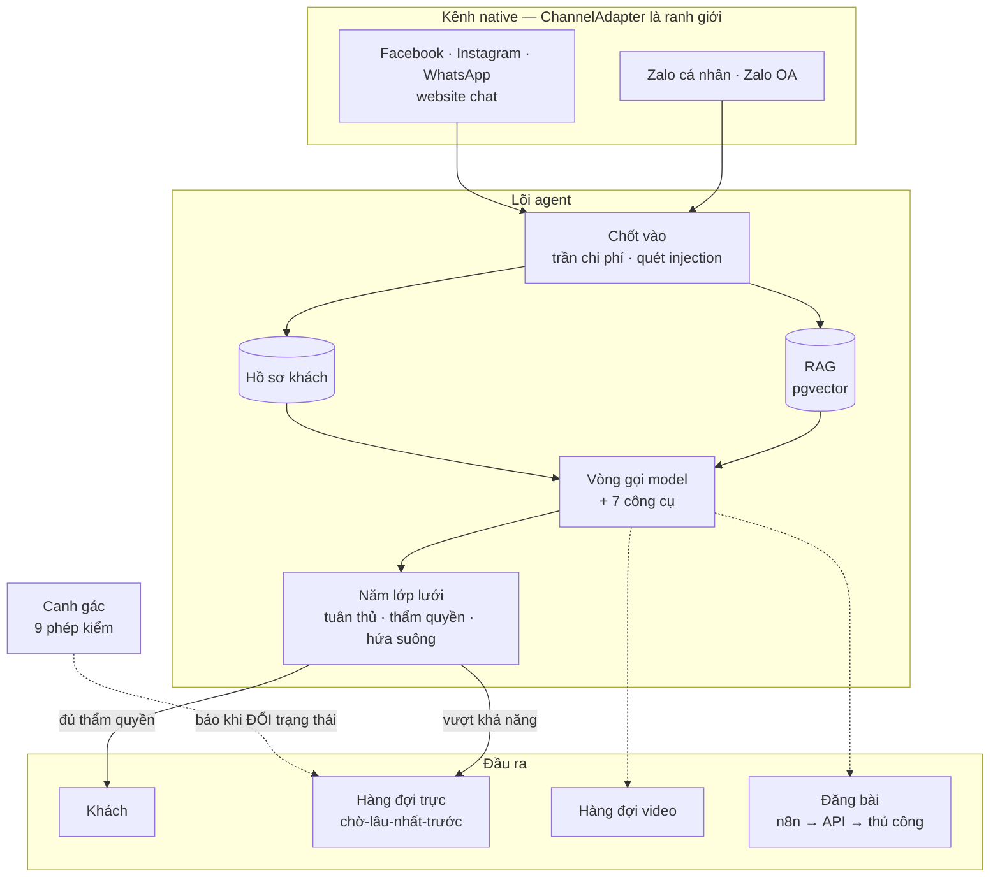
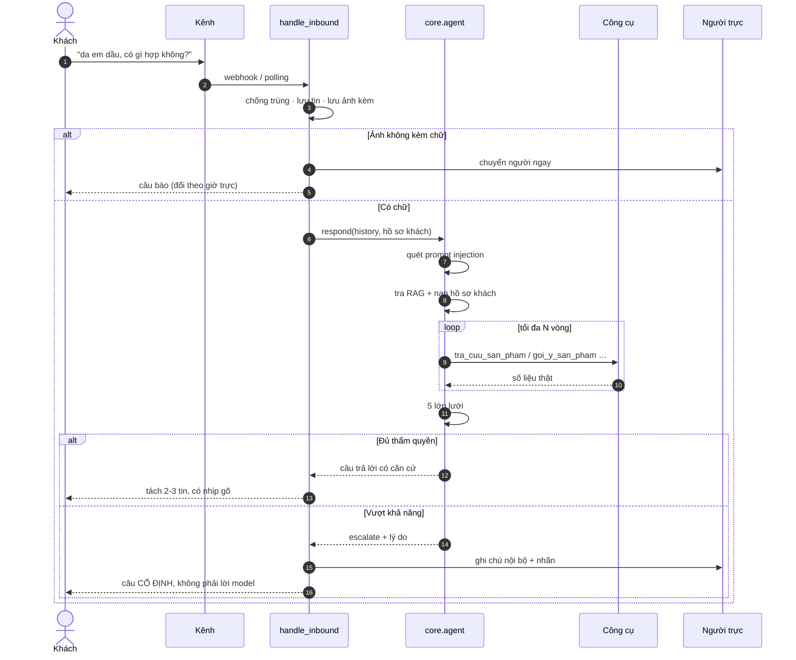
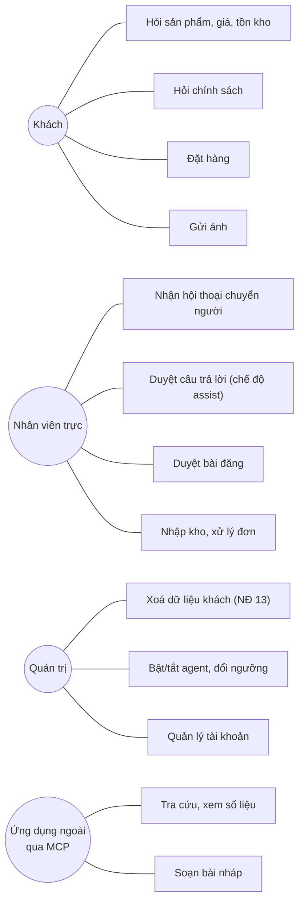

# Kiến trúc hệ thống

> **Sơ đồ cơ sở dữ liệu trong tài liệu này được SINH RA từ
> `agent/schema.sql` và `agent/migrations/versions/*.sql`** bằng
> `python -m scripts.sinh_so_do --ghi`.
> Đừng sửa tay phần đó — sửa schema rồi sinh lại.
>
> Lý do: sơ đồ vẽ tay đúng đúng một ngày, ngày người ta vẽ nó. Repo này đã
> dính hai lần tài liệu nói ngược mã trong cùng một ngày, nên phần nào sinh
> được thì sinh.

---

## 1. Sơ đồ khối

Hai ranh giới quyết định toàn bộ hình dạng hệ thống: `ChannelAdapter` ở đầu
vào và `PublishAdapter` ở đầu ra. Đổi Zalo cá nhân sang Zalo OA là viết
thêm một lớp con — không đụng agent, RAG, video hay dashboard.

---

## 2. Luồng một tin nhắn

Đường đi từ lúc khách gõ tới lúc có người nhận việc. Nhánh **ảnh không kèm
chữ** tách riêng có chủ đích: nhìn ảnh da rồi khuyên dùng gì chính là chẩn
đoán, việc mà hệ thống không có thẩm quyền.

---

## 3. Trường hợp sử dụng

---

## 4. Cơ sở dữ liệu

43 bảng, chia theo phần nghiệp vụ. `schema.sql` là baseline; mọi
thay đổi mới đi qua migration có version và checksum:

| Nhóm | Bảng |
|---|---|
| **Hội thoại** | `conversations` · `messages` · `ho_so_khach` · `processed_webhooks` |
| **Bán hàng** | `orders` · `ton_kho` · `kho_bien_dong` |
| **Tri thức (RAG)** | `documents` · `chunks` |
| **Nội dung** | `videos` · `video_assets` · `posts` · `post_metrics` |
| **Vận hành** | `nguoi_dung` · `phien` · `events` · `zalo_oa_token` · `ky_nang_cai_dat` · `tich_hop_ung_dung` |
| **Tài khoản kênh** | `channel_accounts` · `credential_secrets` · `account_memberships` · `account_health_events` |
| **Inbox native** | `webhook_deliveries` · `attachments` · `outbox_jobs` · `inbox_events` · `conversation_reads` · `worker_heartbeats` |
| **Customer 360** | `contacts` · `contact_points` · `contact_tags` · `contact_notes` · `contact_consents` · `contact_merges` · `data_retention_jobs` |
| **Routing và SLA** | `teams` · `team_members` · `routing_rules` · `routing_cursors` · `conversation_assignments` · `sla_policies` · `sla_events` |

Invariant định tuyến quan trọng nhất là `(account_id, external_id)`, không
phải `(channel, external_id)`. Hai Page có thể cùng nhìn thấy một external
ID; thiếu account scope sẽ nhập nhầm hội thoại và gửi reply ra sai Page.
Adapter gắn `account_id` từ lúc parse inbound; outbound lấy account từ bản
ghi conversation và fail closed khi account sai hoặc đã bị khóa.

```mermaid
erDiagram
    conversations {
        UUID id
        TEXT channel
        TEXT nen_tang
        TEXT external_id
        TEXT customer_name
        TEXT customer_ref
        TEXT status
        TEXT outcome
        _ con_17_cot_nua
    }
    messages {
        UUID id
        UUID conversation_id
        TEXT role
        TEXT content
        BOOLEAN delivered
        NUMERIC cost_usd
        JSONB attachments
        TEXT direction
        _ con_3_cot_nua
    }
    documents {
        UUID id
        TEXT title
        TEXT source
        INT chunk_count
    }
    chunks {
        UUID id
        UUID document_id
        INT ord
        TEXT content
    }
    videos {
        UUID id
        UUID conversation_id
        TEXT title
        TEXT brief
        TEXT kind
        TEXT status
        TEXT renderer
        REAL duration_s
        _ con_4_cot_nua
    }
    video_assets {
        UUID id
        UUID video_id
        INT ord
        TEXT file_path
        INT width
        INT height
        JSONB analysis
        BOOLEAN usable
    }
    events {
        BIGSERIAL id
        TEXT kind
        TEXT actor
        UUID ref_id
        JSONB detail
    }
    processed_webhooks {
        TEXT message_key
    }
    orders {
        UUID id
        TEXT ma_don
        UUID conversation_id
        TEXT channel
        TEXT khach_ten
        TEXT khach_sdt
        TEXT khach_dia_chi
        JSONB items
        _ con_24_cot_nua
    }
    posts {
        UUID id
        UUID video_id
        TEXT tieu_de
        TEXT noi_dung
        JSONB hashtags
        JSONB kenh
        TEXT trang_thai
        TIMESTAMPTZ lich_dang
        _ con_2_cot_nua
    }
    post_metrics {
        BIGSERIAL id
        UUID post_id
        TEXT kenh
        TEXT url
        BIGINT luot_xem
        BIGINT luot_thich
        BIGINT binh_luan
        BIGINT chia_se
        _ con_2_cot_nua
    }
    ho_so_khach {
        UUID id
        TEXT customer_ref
        TEXT channel
        TEXT ten
        TEXT sdt
        JSONB ghi_nho
        TIMESTAMPTZ lan_dau
        TIMESTAMPTZ lan_cuoi
    }
    ton_kho {
        TEXT ma
        INT so_luong
        TIMESTAMPTZ cap_nhat_luc
    }
    kho_bien_dong {
        BIGSERIAL id
        TEXT ma
        INT thay_doi
        TEXT ly_do
        TEXT ma_don
        TEXT ghi_chu
        TIMESTAMPTZ luc
    }
    nguoi_dung {
        UUID id
        TEXT ten_dang_nhap
        TEXT mat_khau_bam
        TEXT ho_ten
        TEXT vai_tro
        BOOLEAN khoa
        TIMESTAMPTZ tao_luc
        TIMESTAMPTZ dang_nhap_cuoi
    }
    phien {
        TEXT token
        UUID nguoi_dung_id
        TIMESTAMPTZ tao_luc
        TIMESTAMPTZ het_han
    }
    zalo_oa_token {
        TEXT app_id
        TEXT refresh_token
    }
    channel_accounts {
        UUID id
        TEXT channel
        TEXT display_name
        TEXT external_account_id
        TEXT status
        JSONB capabilities
        JSONB metadata
        BOOLEAN is_legacy
        _ con_1_cot_nua
    }
    credential_secrets {
        UUID account_id
        INT key_version
        BYTEA nonce
        BYTEA ciphertext
    }
    account_memberships {
        UUID account_id
        UUID user_id
        TEXT role
        KEY PRIMARY
    }
    account_health_events {
        BIGSERIAL id
        UUID account_id
        TEXT status
        TEXT code
        JSONB detail
        TIMESTAMPTZ observed_at
    }
    webhook_deliveries {
        UUID id
        UUID account_id
        TEXT dedupe_key
        TEXT raw_sha256
        BOOLEAN signature_valid
        TEXT status
        INT attempts
        JSONB metadata
        _ con_3_cot_nua
    }
    attachments {
        UUID id
        UUID message_id
        INT ordinal
        TEXT kind
        TEXT url
        TEXT original_url
        TEXT storage_key
        TEXT mime_type
        _ con_2_cot_nua
    }
    outbox_jobs {
        UUID id
        UUID account_id
        UUID conversation_id
        UUID message_id
        TEXT kind
        JSONB payload
        TEXT idempotency_key
        TEXT status
        _ con_7_cot_nua
    }
    inbox_events {
        BIGSERIAL sequence_id
        UUID account_id
        TEXT topic
        UUID ref_id
        JSONB payload
    }
    conversation_reads {
        UUID conversation_id
        UUID user_id
        TIMESTAMPTZ last_read_at
        KEY PRIMARY
    }
    worker_heartbeats {
        TEXT worker_name
        TEXT worker_id
        TIMESTAMPTZ last_seen_at
        JSONB detail
    }
    contacts {
        UUID id
        TEXT display_name
        TEXT phone
        TEXT email
        JSONB profile
        TEXT status
        UUID merged_into
        INT version
        _ con_2_cot_nua
    }
    contact_points {
        UUID id
        UUID contact_id
        UUID channel_account_id
        TEXT external_user_id
        TEXT handle
        JSONB verified_fields
        JSONB metadata
        TIMESTAMPTZ first_seen
        _ con_1_cot_nua
    }
    contact_tags {
        UUID contact_id
        TEXT tag
        UUID created_by
        KEY PRIMARY
    }
    contact_notes {
        UUID id
        UUID contact_id
        TEXT body
        TEXT visibility
        UUID created_by
    }
    contact_consents {
        UUID id
        UUID contact_id
        UUID account_id
        TEXT purpose
        TEXT status
        TEXT source
        JSONB evidence
        UUID captured_by
        _ con_2_cot_nua
    }
    contact_merges {
        UUID id
        UUID source_contact_id
        UUID target_contact_id
        UUID actor_id
        TEXT reason
        INT expected_source_version
        INT expected_target_version
        JSONB snapshot
        _ con_4_cot_nua
    }
    data_retention_jobs {
        UUID id
        UUID contact_id
        TEXT kind
        TEXT status
        UUID requested_by
        UUID approved_by
        TEXT reason
        BOOLEAN dry_run
        _ con_4_cot_nua
    }
    teams {
        UUID id
        TEXT name
        TEXT description
        TEXT status
    }
    team_members {
        UUID team_id
        UUID user_id
        TEXT role
        JSONB skills
        INT max_active
        BOOLEAN is_available
        TIMESTAMPTZ joined_at
        KEY PRIMARY
    }
    sla_policies {
        UUID id
        UUID account_id
        TEXT priority
        INT first_response_minutes
        INT resolution_minutes
        JSONB business_hours
        BOOLEAN active
        NULLS UNIQUE
    }
    routing_rules {
        UUID id
        UUID account_id
        UUID team_id
        TEXT priority
        JSONB required_skills
        INT weight
        BOOLEAN active
    }
    conversation_assignments {
        UUID id
        UUID conversation_id
        UUID assigned_user_id
        UUID assigned_team_id
        UUID actor_id
        TEXT source
        TEXT reason
        TIMESTAMPTZ started_at
        _ con_1_cot_nua
    }
    sla_events {
        BIGSERIAL id
        UUID conversation_id
        TEXT kind
        TIMESTAMPTZ due_at
        JSONB detail
    }
    routing_cursors {
        UUID rule_id
        UUID last_user_id
    }
    ky_nang_cai_dat {
        TEXT ten
        BOOLEAN bat
        JSONB ban_mo_ta
        TEXT tao_boi
        TIMESTAMPTZ tao_luc
        TIMESTAMPTZ sua_luc
    }
    tich_hop_ung_dung {
        TEXT ten
        TEXT nhan
        TEXT dia_chi
        BOOLEAN bat
        TEXT tao_boi
        TIMESTAMPTZ tao_luc
        TIMESTAMPTZ sua_luc
    }
    channel_accounts ||--o{ account_health_events : ""
    channel_accounts ||--o{ account_memberships : ""
    nguoi_dung ||--o{ account_memberships : ""
    messages ||--o{ attachments : ""
    documents ||--o{ chunks : ""
    channel_accounts ||--o{ contact_consents : ""
    contacts ||--o{ contact_consents : ""
    nguoi_dung ||--o{ contact_consents : ""
    contacts ||--o{ contact_merges : ""
    nguoi_dung ||--o{ contact_merges : ""
    contacts ||--o{ contact_notes : ""
    nguoi_dung ||--o{ contact_notes : ""
    channel_accounts ||--o{ contact_points : ""
    contacts ||--o{ contact_points : ""
    contacts ||--o{ contact_tags : ""
    nguoi_dung ||--o{ contact_tags : ""
    contacts ||--o{ contacts : ""
    conversations ||--o{ conversation_assignments : ""
    nguoi_dung ||--o{ conversation_assignments : ""
    teams ||--o{ conversation_assignments : ""
    conversations ||--o{ conversation_reads : ""
    nguoi_dung ||--o{ conversation_reads : ""
    channel_accounts ||--o{ conversations : ""
    contact_points ||--o{ conversations : ""
    contacts ||--o{ conversations : ""
    nguoi_dung ||--o{ conversations : ""
    teams ||--o{ conversations : ""
    channel_accounts ||--o{ credential_secrets : ""
    contacts ||--o{ data_retention_jobs : ""
    nguoi_dung ||--o{ data_retention_jobs : ""
    channel_accounts ||--o{ inbox_events : ""
    conversations ||--o{ messages : ""
    conversations ||--o{ orders : ""
    channel_accounts ||--o{ outbox_jobs : ""
    conversations ||--o{ outbox_jobs : ""
    messages ||--o{ outbox_jobs : ""
    nguoi_dung ||--o{ phien : ""
    posts ||--o{ post_metrics : ""
    videos ||--o{ posts : ""
    nguoi_dung ||--o{ routing_cursors : ""
    routing_rules ||--o{ routing_cursors : ""
    channel_accounts ||--o{ routing_rules : ""
    teams ||--o{ routing_rules : ""
    conversations ||--o{ sla_events : ""
    channel_accounts ||--o{ sla_policies : ""
    nguoi_dung ||--o{ team_members : ""
    teams ||--o{ team_members : ""
    videos ||--o{ video_assets : ""
    conversations ||--o{ videos : ""
    channel_accounts ||--o{ webhook_deliveries : ""
```

Sơ đồ lược bớt các cột đo lường (`tokens_in`, `latency_ms`, `created_at`…)
để còn đọc được. Định nghĩa đầy đủ nằm ở [`agent/schema.sql`](../agent/schema.sql).

---

## 5. Bảy nguyên tắc

| Nguyên tắc | Nằm ở đâu |
|---|---|
| Không phát ngôn không căn cứ — giá, tồn kho, đơn chỉ đến từ công cụ | `agent/core/tools.py` |
| Nội dung ra công chúng luôn phải có người duyệt — ràng buộc trong MÃ, không trong prompt | `agent/publish/service.py` |
| Âm thanh trước, hình sau — thời lượng đo bằng `ffprobe`, không để model đoán | `agent/video/timing.py` |
| Biết dừng đúng lúc — năm lớp lưới độc lập, mỗi lớp canh một cách trượt | `agent/core/agent.py` |
| Reply đúng tài khoản nguồn — không fallback khi `account_id` sai | `agent/channels/factory.py`, `agent/api/routes.py` |
| Bí mật từng account chỉ tồn tại dưới dạng AES-GCM ciphertext | `agent/security/credential_vault.py` |
| Migration tiến về phía trước có version, checksum và transaction lock | `agent/migrations/runner.py` |
