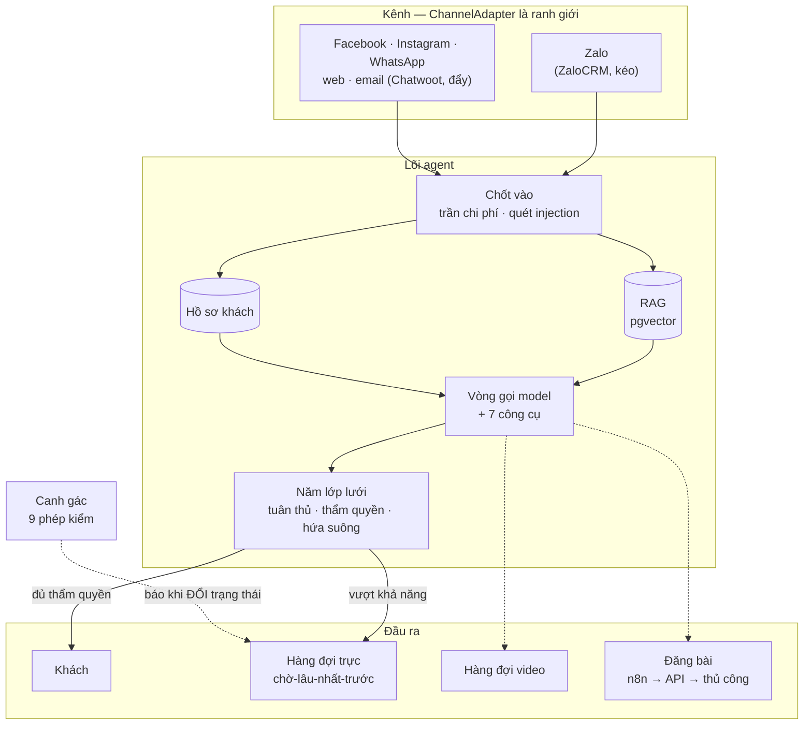
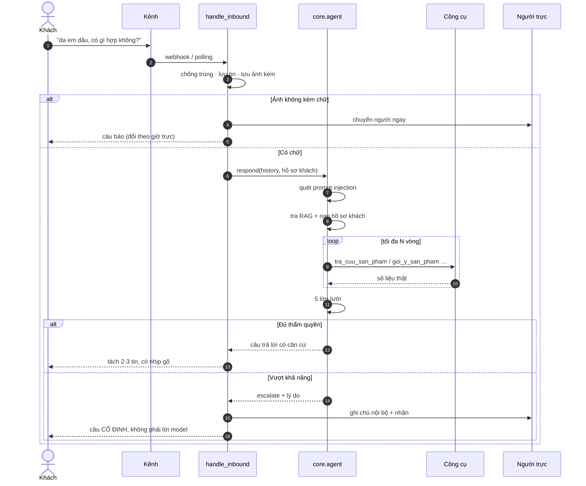
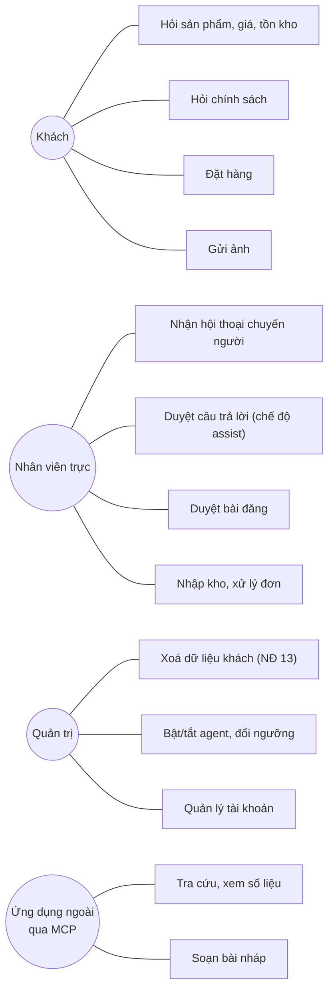
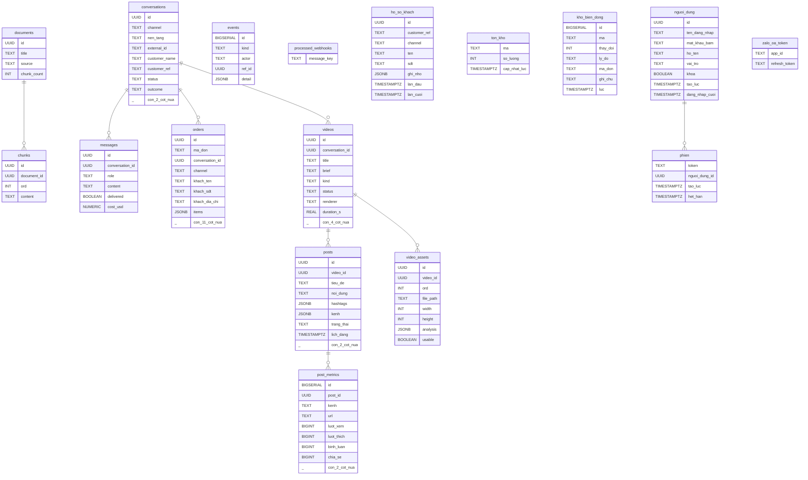

# Kiến trúc hệ thống

> **Sơ đồ cơ sở dữ liệu trong tài liệu này được SINH RA từ
> `agent/schema.sql`** bằng `python -m scripts.sinh_so_do --ghi`.
> Đừng sửa tay phần đó — sửa schema rồi sinh lại.
>
> Lý do: sơ đồ vẽ tay đúng đúng một ngày, ngày người ta vẽ nó. Repo này đã
> dính hai lần tài liệu nói ngược mã trong cùng một ngày, nên phần nào sinh
> được thì sinh.

---

## 1. Sơ đồ khối

Hai ranh giới quyết định toàn bộ hình dạng hệ thống: `ChannelAdapter` ở đầu
vào và `PublishAdapter` ở đầu ra. Đổi Zalo cá nhân sang Zalo OA là viết
thêm một lớp con — không đụng agent, RAG, video hay dashboard.

---

## 2. Luồng một tin nhắn

Đường đi từ lúc khách gõ tới lúc có người nhận việc. Nhánh **ảnh không kèm
chữ** tách riêng có chủ đích: nhìn ảnh da rồi khuyên dùng gì chính là chẩn
đoán, việc mà hệ thống không có thẩm quyền.

---

## 3. Trường hợp sử dụng

---

## 4. Cơ sở dữ liệu

17 bảng, chia theo phần nghiệp vụ:

| Nhóm | Bảng |
|---|---|
| **Hội thoại** | `conversations` · `messages` · `ho_so_khach` · `processed_webhooks` |
| **Bán hàng** | `orders` · `ton_kho` · `kho_bien_dong` |
| **Tri thức (RAG)** | `documents` · `chunks` |
| **Nội dung** | `videos` · `video_assets` · `posts` · `post_metrics` |
| **Vận hành** | `nguoi_dung` · `phien` · `events` · `zalo_oa_token` |

Sơ đồ lược bớt các cột đo lường (`tokens_in`, `latency_ms`, `created_at`…)
để còn đọc được. Định nghĩa đầy đủ nằm ở [`agent/schema.sql`](../agent/schema.sql).

---

## 5. Bốn nguyên tắc

| Nguyên tắc | Nằm ở đâu |
|---|---|
| Không phát ngôn không căn cứ — giá, tồn kho, đơn chỉ đến từ công cụ | `agent/core/tools.py` |
| Nội dung ra công chúng luôn phải có người duyệt — ràng buộc trong MÃ, không trong prompt | `agent/publish/service.py` |
| Âm thanh trước, hình sau — thời lượng đo bằng `ffprobe`, không để model đoán | `agent/video/timing.py` |
| Biết dừng đúng lúc — năm lớp lưới độc lập, mỗi lớp canh một cách trượt | `agent/core/agent.py` |
